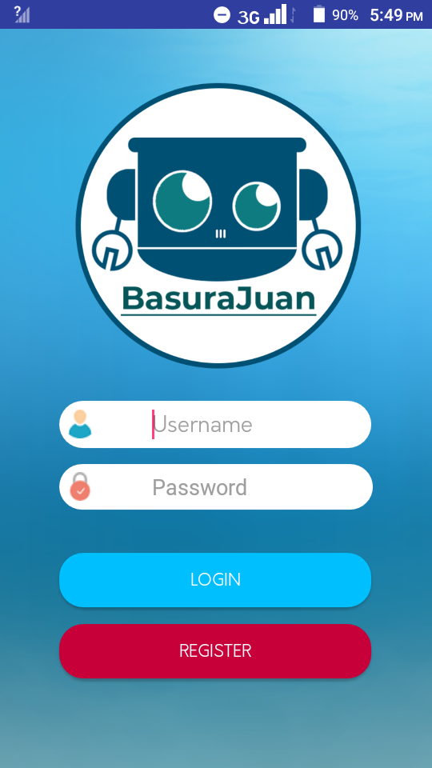
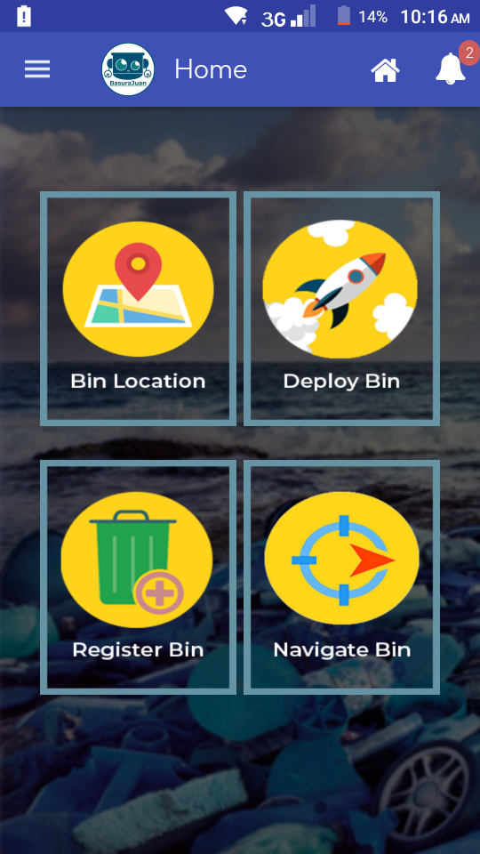
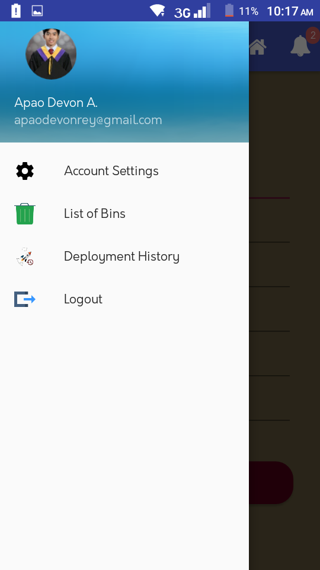
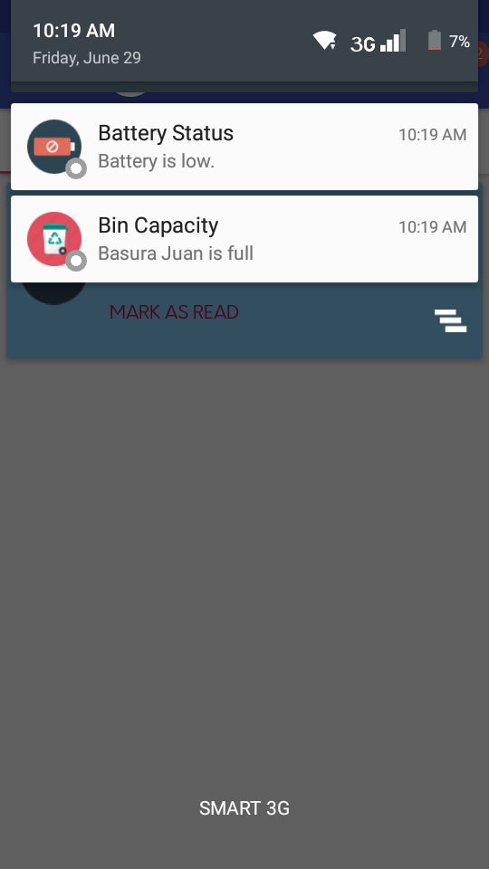
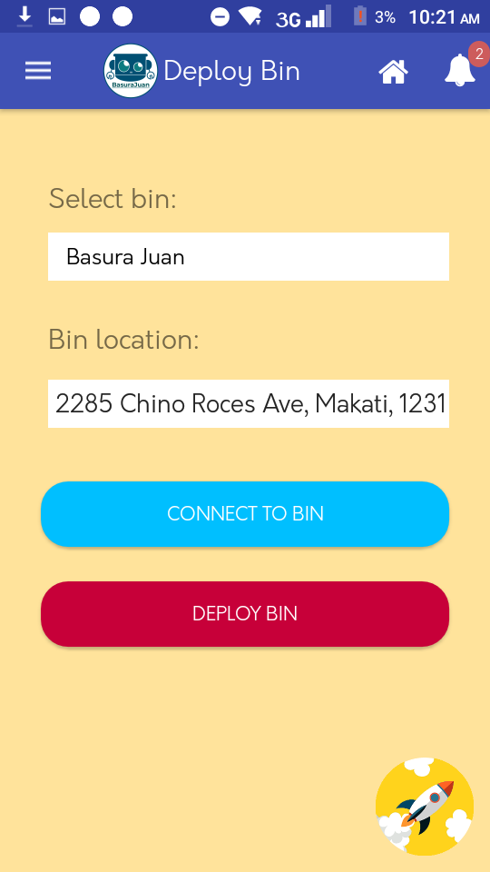

# Basura Juan

Basura Juan is a robotic garbage collector built on top of Android and Arduino based technology.

    
    
       

    
    
       

## Getting Started

### Prerequisites

- Android API level 17 to 25

## Features

- Manual garbage collection of robot via android device.
- Automated garbage collection robot via sensors.
- Recording of deployment and usage history of robot.
- Monitor location of robot through integraton of hardware's GPS module and application Google maps.
- Monitor robot status whether idle / deployed.
- Realtime push notifications displaying the robot status. 

## Built with

- Volley - network processing , json parsing  REST client management library. 
- Picasso - image management library.
- Android Design Support Library - android material design components, backward compatability.
- x10hosting.com - web hosting for web services.
- php - data access logic, and query logic for mysqli database.
- mysql - database provider of android application.

